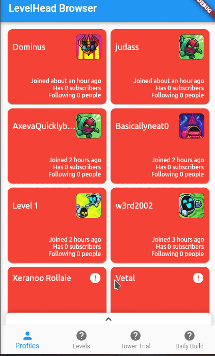

# LevelHead Browser

An Android application to browse levels, profiles, daily build levels and tower trial levels etc.

Currently, the application is in preview stage. [There is a devlog](https://www.youtube.com/watch?v=P9ChYHl8gdE&list=PLbJe7nxsM6nXbQnq1gq8DCw878A6FA-zb) **in Turkish** if you are interested.

## Downloads

Please remember that Levelhead Browser is still in preview stage and will not work as intended. However, there are regular builds you can still enjoy.

**Android APK:** [Click here](https://nightly.link/erayerdin/levelheadbrowser/workflows/build/master/android-apk.zip)

It is also possible to build Levelhead Browser as native Linux application. We cannot share Linux app as binary (see [#1](https://github.com/erayerdin/levelheadbrowser/issues/1)). So you can clone this repository and do `flutter run -d linux` to build and run the application.

## Screenshots

This is how profile page looks like:

## License

This project is licensed under [Mozilla Public License 2.0](https://www.mozilla.org/en-US/MPL/2.0/).
